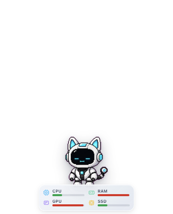
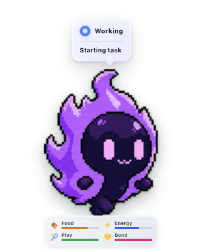
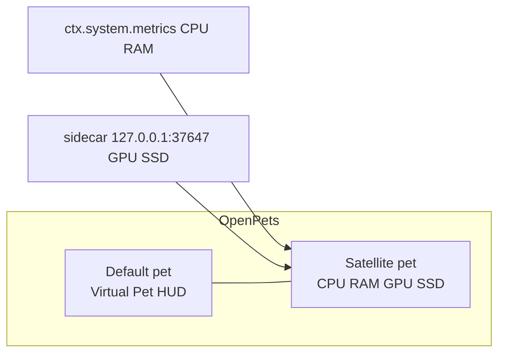

# OpenPets System Resources

[](LICENSE)

<p align="center">
  
  
</p>

Live **CPU and RAM** to the left of your pet. Virtual Pet stats (food, energy, play, bond) stay on the pet.

**GPU and SSD:** catalog install does not include them. Follow **[See GPU and SSD](docs/gpu-ssd.md)** — install [Node.js](https://nodejs.org/), clone this repo, run `npm run install-sidecar`, approve `network:local` in OpenPets.

## Catalog package

```bash
npm test
npm run package:catalog
```

Writes `dist/openpets.system-resources-1.4.1.zip` plus a `.sha256` file. The ZIP contains only the manifest, `index.js`, declared icons, locales, and `LICENSE`.

## Unpacked plugin load

Developer Mode → **Load unpacked plugin folder**. Approve `system:metrics`, `network:local`, `pets:manage`, and `pet:move`. GPU/SSD: [See GPU and SSD](docs/gpu-ssd.md).

## Config

- **Language**: automatic / Nederlands / English / Français / Deutsch
- HUD on/off, poll 5–60s, alert threshold, speak on high load

## Commands

- Show / hide resource HUD
- Read resources (or click the pet)

## Development

```bash
npm test
```



The resource HUD pins on an ephemeral satellite pet (`SATELLITE_OFFSET_X = -180`), never on the default pet pin slot.

## License

[MIT](LICENSE) — use, copy, modify, sell: all fine. Keep the copyright notice.
