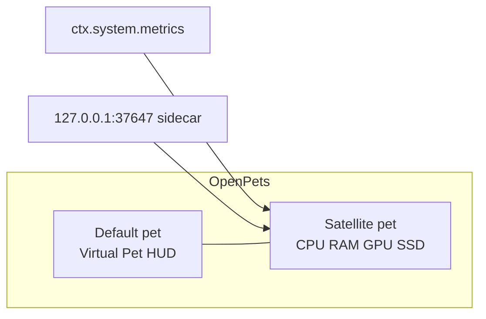

# OpenPets System Resources

[](LICENSE)


Live CPU, RAM, GPU, and SSD **to the left of your pet**. Virtual Pet stats (food, energy, play, bond) stay on the pet.

GPU and SSD come from a local sidecar. OpenPets plugin load does **not** install it: run the installer once per machine, then it starts at login.

## First install

Needs [Node.js](https://nodejs.org/) on PATH. Then in this folder:

```bash
npm run install-sidecar
```

The script picks the OS:

| OS | What gets installed | After reboot / login |
|---|---|---|
| macOS | LaunchAgent `nl.axtro.openpets-metrics` | `RunAtLoad` + `KeepAlive` |
| Linux | systemd user `openpets-metrics.service` | `enable --now` + linger when possible |
| Windows | Scheduled Task `OpenPetsMetricsSidecar` | trigger `AtLogOn` |

Check: `curl -s http://127.0.0.1:37647/health` → `{"ok":true}` (Windows: `Invoke-RestMethod http://127.0.0.1:37647/health`).

Skip this step and CPU/RAM still work; GPU/SSD stay `—` / status `sidecar offline`.

Foreground without a persistent service: `npm run sidecar`.

## Load in OpenPets

1. Sidecar as above.
2. OpenPets → Plugins → Developer Mode → **Load unpacked plugin folder**.
3. Approve `system:metrics`, `network:local`, `pets:manage`, and `pet:move`.

Manual per OS: `npm run install-sidecar:mac` / `:linux` / `:windows`.

## Config

- **Operating system**: automatic (OpenPets) / macOS / Windows / Linux — GPU/SSD sources for the sidecar
- **Language**: automatic / Nederlands / English / Français / Deutsch
- HUD on/off, poll 5–60s, alert threshold, speak on high load

## Commands

- Show / hide resource HUD
- Read resources (or click the pet)

## Development

```bash
npm test
```

Then sidecar health: `curl -s http://127.0.0.1:37647/metrics`.



The resource HUD pins on an ephemeral satellite pet (`SATELLITE_OFFSET_X = -180`), never on the default pet pin slot.

## License

[MIT](LICENSE) — use, copy, modify, sell: all fine. Keep the copyright notice.
